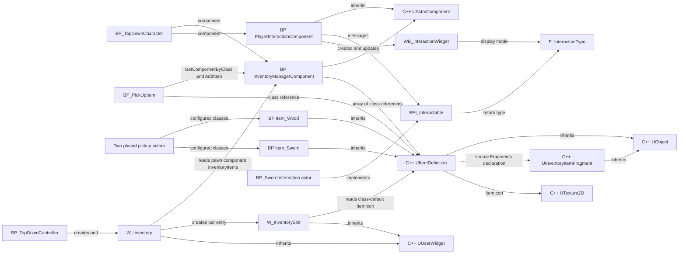

# Null Tide Inventory and Item Architecture Audit

Date: 2026-09-14

## Outcome

The current inventory is a small Blueprint implementation backed by a native item-definition class. InventoryManagerComponent stores an array of item **class references**, BP_PickUpItem appends its configured class on overlap, and W_Inventory creates one icon widget per array entry. There is no inspected item-instance, quantity/stack, removal, persistence, or replication implementation.

The most serious finding is a mismatch between source and the running editor: assets successfully reference `/Script/NullTide2.ItemDefinition`, but the current source has several apparent build blockers, and its proposed Fragments property is absent from live reflection. Do not treat the loaded editor classes as proof that this source can rebuild.

## Scope and evidence

- Read the project's Source inventory and relevant headers, implementations, build rules, and project descriptor.
- Enumerated /Game assets through Unreal MCP; inspected inventory, item, interaction, character, controller, and widget metadata, dependencies, properties, graphs, and selected detailed node connections.
- Queried /Game for UserDefinedStruct, UserDefinedEnum, and DataAsset assets; queried reflected UObject subclasses containing Fragment.
- Inspected two loaded pickup instances and their configured item classes in Lvl_TopDown.
- No source or Unreal assets were edited; no compilation, saving, PIE, or gameplay execution was requested. This report is the only intentional filesystem change.
- Graph inspection establishes wiring, not successful runtime behavior. Registry dependencies can include unused/disconnected nodes and editor metadata; they do not by themselves establish runtime execution or distinguish all hard/soft reference categories.
- The DSL graph reader omits some execution paths: it reported only an empty I event where detailed node pins proved a working UI creation chain. Input-related conclusions below use detailed node inspection. A complete engine/plugin audit and packaged-build test were outside scope.

## C++ inventory

Paths below are relative to the project root.

| Declaration | File | Inheritance and exposure | Status |
|---|---|---|---|
| UItemDefinition | `Source/NullTide2/Content/InteractionSystem/Items/ItemDefinition.h:12` | UObject; Blueprintable, BlueprintType, Abstract, Const | Intended item metadata base; live native class is referenced by assets |
| UInventoryItemFragment | `Source/NullTide2/Content/InteractionSystem/Fragments/InventoryItemFragment.h:11` | UObject; Blueprintable, BlueprintType, Abstract, DefaultToInstanced, EditInlineNew | Empty proposed fragment base; not returned by live Fragment subclass search |
| InventoryItemFragment | `Source/NullTide2/Public/InventoryItemFragment.h:10` | No base; plain C++, no UCLASS | Separate empty constructor/destructor class; not Blueprint exposed |
| AInventoryItemFragment | `Source/NullTide2/Content/InteractionSystem/Fragments/InventoryItemFragment.cpp:8` | No matching declaration found | Implements constructor, BeginPlay and Tick for a different class name than its adjacent header |

UItemDefinition declares:

| Property | Source type | Exposure |
|---|---|---|
| ItemName | FText | EditDefaultsOnly, BlueprintReadOnly, Display |
| ItemDescription | FText | EditDefaultsOnly, BlueprintReadOnly, Display |
| ItemIcon | TObjectPtr<UTexture2D> | EditDefaultsOnly, BlueprintReadOnly, Display |
| Fragments | TArray<TIsTObjectPtr<UInventoryItemFragment>> | EditDefaultsOnly, BlueprintReadOnly, Fragments Array |

No UFUNCTION declarations, project USTRUCT, UENUM, or UINTERFACE declarations were found in Source. There is no native inventory manager/component or native pickup class declared there. The plain fragment implementation is in `Source/NullTide2/Private/InventoryItemFragment.cpp`; ItemDefinition.cpp only includes its header.

The runtime module is NullTide2. Its Build.cs lists Core, CoreUObject, Engine and InputCore as public dependencies and no private dependencies. The project descriptor declares no InventorySystem module.

## Blueprint and asset catalog

Path abbreviations: **INV** = `/Game/LevelPrototyping/InventorySystem`; **INT** = `/Game/LevelPrototyping/interactionSystem`; **TD** = `/Game/TopDown/Blueprints`. Append `.uasset` beneath Content to obtain the local asset filename from a /Game path.

| Asset | Path | Parent/type | Role and inspected members |
|---|---|---|---|
| InventoryManagerComponent | INV/InventoryManagerComponent | ActorComponent | InventoryItems: array of ItemDefinition class references; AddItem(ItemDefinitions); empty BeginPlay/Tick |
| BP_PickUpItem | INV/BP_PickUpItem | Actor | ItemDefinition class reference; DefaultSceneRoot, StaticMesh, Sphere; ActorBeginOverlap pickup |
| Item_Wood | INV/Items/Item_Wood | Native NullTide2.ItemDefinition | Data-only, Const Blueprint; no local variables or graphs |
| Item_Sword | INV/Items/Item_Sword | Native NullTide2.ItemDefinition | Data-only, Const Blueprint; no local variables or graphs |
| W_Inventory | INV/UI/Widgets/W_Inventory | UserWidget | InventoryContainerWrapBox; Construct and OnKeyDown graphs; no explicit Blueprint member variables |
| W_InventorySlot | INV/UI/Widgets/W_InventorySlot | UserWidget | ItemDefinition class reference exposed on CreateWidget; ItemIcon Image; Construct reads class-default icon |
| PlayerInteractionComponent | INT/PlayerInteractionComponent | ActorComponent | InteractableInRange: Actor array; CharacterRef; InteractionWidgetComponent; InteractionWidgetRef; OnInteractionPressOngoing dispatcher |
| BPI_Interactable | INT/BPI_Interactable | Blueprint interface | Interact(Interactor), GetInteractionType(), GetHoldDuration() |
| E_InteractionType | INT/E_InteractionType | UserDefinedEnum | Press, Hold, confirmed through widget property schema |
| WB_interactionWidget | INT/WB_interactionWidget | UserWidget | InteractionType; InteractText TextBlock, InteractProgressBar ProgressBar, BackgroundColor Image; SetProgressPercent |
| BP_TopDownCharacter | TD/BP_TopDownCharacter | Character | Hosts InventoryManagerComponent and PlayerInteractionComponent, plus Camera/SpringArm and inherited character components |
| BP_TopDownController | TD/BP_TopDownController | PlayerController | I-key inventory UI creation; MoveTo, Follow, cursor/finger location functions |
| BP_Sword | /Game/LevelPrototyping/Interactable/Sword/BP_Sword | Actor, implements BPI_Interactable | InteractionType/HoldDuration getters; Interact prints, plays sound and destroys actor; no inventory dependency |
| BP_Door | /Game/LevelPrototyping/Interactable/Door/BP_Door | Actor, implements BPI_Interactable | Adjacent interaction consumer, identified from metadata; behavior not audited |

BP_JumpPad and BP_WobbleTarget metadata showed Actor parents and no ImplementedInterfaces tag. Their gameplay was not audited. BP_PickUpItem likewise has no reported interface implementation and its inspected graph uses overlap directly, bypassing BPI_Interactable.

### Item data and fragments

| Item Blueprint | Live default name | Live description | Icon |
|---|---|---|---|
| Item_Wood | Wood | Wood nè | /Engine/EngineResources/AICON-Green |
| Item_Sword | Sword | Sword nè | /Engine/EngineResources/AICON-Red |

These are **data-only Blueprint classes**, not UDataAsset instances. Live property inspection returned only itemName, itemDescription and itemIcon; no Fragments property. The UObject Fragment subclass query returned only Engine.DeviceProfileFragment, an unrelated engine type. No project fragment subclasses or fragment data assets were identified.

No /Game UserDefinedStruct assets were found. The only /Game UserDefinedEnum found was E_InteractionType. No dedicated inventory entry, stack, item-instance, or inventory enum was identified.

The /Game DataAsset query returned IA_Jump, IA_Move, IA_Interact, IA_DropItem, IA_OpeningInventory and IMC_Default, all under `/Game/TopDown/Input`. No inventory/item UDataAsset instances were returned. IA_DropItem and IA_OpeningInventory each have IMC_Default as their only reported referencer; inventory UI currently uses a literal I key.

## Dependency map

Arrows mean the source depends on, holds, creates, inherits from, or calls the destination as labeled. The dashed fragment edge is source-only and is not verified in the live class. Engine base classes are included where they establish the architecture.

### Dependency categories and evidence

| Category | Confirmed edges | Evidence |
|---|---|---|
| C++ -> C++ | UItemDefinition -> UObject, UTexture2D, proposed UInventoryItemFragment; UInventoryItemFragment -> UObject | Source declarations; fragment array currently malformed |
| Blueprint -> C++ | Item_Wood/Item_Sword -> NullTide2.ItemDefinition; inventory/pickup/slot -> ItemDefinition class type | Parent tags and reflected variable/node pin types |
| Blueprint -> C++ engine | Inventory/interaction components -> ActorComponent; pickup/sword -> Actor; character -> Character; controller -> PlayerController; widgets -> UserWidget | Parent metadata; component property schemas |
| Blueprint -> Blueprint | Character -> both components; pickup -> inventory component; controller -> W_Inventory; W_Inventory -> W_InventorySlot; interaction component -> BPI_Interactable/WB_interactionWidget | Registry dependencies, reflected components, graph connections |
| UI -> Inventory | W_Inventory -> owning player's pawn -> concrete InventoryManagerComponent -> InventoryItems | Construct node chain; UI reads array directly |
| Item -> Inventory | BP_PickUpItem -> InventoryManagerComponent.AddItem(ItemDefinition) | Detailed overlap graph; success path then destroys pickup |
| Item definition -> Inventory | No reverse reference from Item_Wood/Item_Sword to InventoryManagerComponent | Item dependencies contain native module and icon only; inventory owns the reference to the definition |
| Older item interaction -> Inventory | No edge from BP_Sword to inventory | Registry and Interact graph: feedback and destruction only |

The manager has no UI dependency in its reported dependencies or inspected graphs. No direct inventory/UI dependency cycle was found in this core set.

## Actual flows

### Pickup and storage

1. BP_PickUpItem receives ActorBeginOverlap.
2. It finds InventoryManagerComponent on OtherActor and checks component validity.
3. It calls AddItem with its ItemDefinition class reference.
4. AddItem performs a plain array Add; no validation, capacity check, stacking, or success return is present.
5. The pickup destroys itself after the call.

InventoryItems defaults to an empty array. The component defaults to bReplicates=false and InventoryItems replication mode is None.

Loaded level instances were inspected at `/Game/TopDown/Lvl_TopDown.Lvl_TopDown:PersistentLevel`:

| Actor object name | Configured class |
|---|---|
| BP_PickUpItem_C_UAID_107C6146D0CA4CFD02_2144703040 | Item_Wood_C |
| BP_PickUpItem_C_UAID_107C6146D0CA4CFD02_2139352039 | Item_Sword_C |

Registry referencers also place these item classes in two external-actor packages, rather than on the generic pickup Blueprint defaults.

### Inventory UI

Detailed controller pins confirm: I Pressed -> Create W_Inventory -> AddToViewport -> show cursor -> SetInputModeUIOnly, focusing the created widget. OwningPlayer is unconnected on CreateWidget.

W_Inventory Construct resolves the owning pawn's inventory component, validates the component, loops over InventoryItems, creates a W_InventorySlot with each definition class, and adds it to InventoryContainerWrapBox. Slot Construct reads ItemIcon from the supplied class defaults and sets the Image brush. No live inventory-change subscription or ClearChildren call appears in this flow.

OnKeyDown handles literal I by hiding the cursor, switching to GameOnly, removing the widget and returning Handled. Its other-key execution branch has no connected explicit return node.

### Interaction system

PlayerInteractionComponent casts its owner to Character, subscribes to capsule overlap delegates, filters actors by BPI_Interactable, and maintains an Actor array. GetActiveInteractable reads the last array element. RenderInteractionWidget creates a screen-space prompt at the active actor location.

Detailed input pins confirm IA_Interact Started calls InteractBegin; Ongoing broadcasts elapsed time; Canceled/Completed unbind all ongoing handlers and reset progress. Press calls Interact immediately. Hold divides elapsed time by the returned hold duration, updates progress, and invokes Interact after the threshold. This input wiring is present even though it was omitted from the DSL summary; runtime input delivery was not tested.

BP_Sword implements the interface but is separate from the inventory pickup flow. Its Interact graph does not add Item_Sword to the manager.

## Risks and unfinished boundaries

| Priority | Finding | Evidence and consequence |
|---|---|---|
| High | Source/editor divergence | Live ItemDefinition exists but current headers omit generated-header includes, use INVENTORYSYSTEM_API rather than the declared module's API macro, and declare a malformed-looking fragment array. Loaded reflection lacks Fragments. Clean rebuild reproducibility is unverified and likely blocked. |
| High | Fragment implementation class mismatch | Adjacent header declares UInventoryItemFragment : UObject; cpp implements undeclared AInventoryItemFragment with actor lifecycle methods. A second unrelated plain InventoryItemFragment adds name/include ambiguity. |
| High | Pickup accepts invalid item configuration | Only the inventory component is validated. Neither pickup nor AddItem checks ItemDefinition. A misconfigured pickup can append a null class and destroy itself, leaving downstream UI without valid item data. The two inspected instances are configured. |
| High if multiplayer is intended | No replicated/authoritative inventory path | Component replication is false, array replication None, and inspected pickup path has no authority/RPC gate. No multiplayer guarantees can be inferred. |
| Medium | Item identity is a class, not an instance | Repeated pickups append repeated class references. No per-item ID, quantity field, durability, ownership metadata, or mutable fragment state exists in inspected storage. Adding these features will require a storage contract decision. |
| Medium | Two incompatible pickup paths | BP_PickUpItem adds to inventory; BP_Sword only prints/plays sound/destroys. Using the sword interaction actor as an inventory pickup loses the expected inventory transfer. |
| Medium | UI tightly coupled to concrete component/storage | W_Inventory searches for one Blueprint component class and reads its public array directly; W_InventorySlot reads native class defaults. Changes to storage type or item metadata propagate into UI graphs. |
| Medium | UI updates only during Construct | No inventory-change dispatcher, refresh subscription, or container clearing was found. Changes while open can be stale; reconstruction of the same widget could append duplicate children. Current controller creates a new widget each opening, reducing the latter risk in that path. |
| Medium | Implicit widget ownership and literal keys | CreateWidget OwningPlayer is unconnected; UI later depends on GetOwningPlayerPawn. This needs validation for multiple local players/possession changes. Open/close hardcode I while IA_OpeningInventory exists separately. |
| Medium | Interaction edge cases | GetActiveInteractable indexes LastIndex without an empty-array guard. Hold progress divides by duration without a positive-duration guard. Cancel/Complete resets InteractionWidgetRef without a validity branch. These paths can produce warnings or invalid-object access under empty/unconfigured states. |
| Medium | Hold target may change mid-interaction | Ongoing processing re-queries the last overlapping actor rather than a captured target. A newly overlapping interactable can inherit elapsed hold time; behavior requires an explicit design decision. |
| Low/Medium | Disconnected nodes retain dependencies | Pickup construction contains an unconnected SetStaticMesh referencing the sword mesh. Interaction graph contains an unconnected pistol montage chain. Registry references therefore overstate executed gameplay and may retain unnecessary asset coupling. |
| Low/Medium | Prototype/editor content dependencies | Pickup references /PCG/SampleContent/MeshSockets/Meshes/1M_CubeWithSocket; BP_Sword uses /Engine/VREditor/Sounds/VR_click1; item icons use engine placeholder textures. Cooking/packaging availability was not tested. Editor script-module dependencies alone are not evidence of a shipping failure. |
| Feature gap | Removal/drop/save/stack APIs absent | Manager exposes only AddItem in its graph inventory; IA_DropItem only has IMC_Default as registry referencer. No implemented drop handler, save representation, stack policy, capacity, or inventory transaction/result contract was found in the audited core. |

## Recommended order of follow-up work

1. Reconcile source with the live native ItemDefinition, resolve fragment naming/header/API/type inconsistencies, then perform an explicitly authorized build validation.
2. Decide whether inventory entries represent individual instances or definition-plus-quantity stacks; keep shared definition metadata separate from mutable entry state.
3. Give AddItem a validated input and explicit result, and destroy pickups only after a successful transfer.
4. Unify or clearly distinguish BP_Sword interaction and BP_PickUpItem behavior; decide whether pickup requires Press/Hold or overlap.
5. Add an inventory query/change contract for UI, explicit widget ownership, and a consistent input action for opening/closing.
6. Define replication/save requirements before adding mutable fragments or per-item state; remove unused prototype dependencies when their replacement is decided.

These are recommendations only. No fixes or project mutations were performed as part of this audit.
