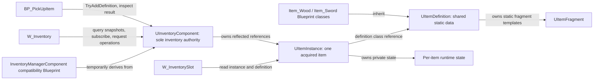

# Inventory V2 — Phase 1 architecture and migration plan

Date: 2026-09-15  
Status: Design only. No implementation, graph edits, reparenting, compilation or asset saves performed. This document is the only planned file write for this request.

## 1. Evidence and baseline

Read AGENTS.md, INVENTORY_AUDIT.md, PROJECT_RENAME_REPORT.md and every current Source file. Queried the eight inventory-related assets through live Unreal MCP for parents and member variables; read current AddItem, pickup overlap and inventory widget Construct graphs; read both item definitions' fragment defaults.

The old audit's native build/header/fragment-reflection problems are historical and resolved. Current source uses NULLTIDE_API, valid generated includes and TArray<TObjectPtr<UInventoryItemFragment>>. The rename report and prior validation record successful native and Blueprint compilation. This design does not reopen baseline stabilization or the module rename.

Current facts:
- Item_Wood and Item_Sword remain data-only Blueprint subclasses of /Script/NullTide.ItemDefinition; both currently have empty Fragments arrays.
- InventoryManagerComponent derives directly from ActorComponent. InventoryItems is the legacy definition-class array. AddItem appends one class without a result contract.
- BP_PickUpItem finds that Blueprint component on OtherActor, adds its configured definition, then destroys itself.
- W_Inventory reads that array on Construct and creates W_InventorySlot widgets. A slot holds a definition class and displays its class-default icon.
- BP_TopDownCharacter hosts the existing components; BP_TopDownController opens inventory UI.
- Source currently defines UItemDefinition and UInventoryItemFragment, but no UItemInstance or UInventoryComponent.
- The package CoreRedirect /Script/NullTide2 -> /Script/NullTide must remain.
- MCP DSL labels are presentation aids, not authoritative function owner names: the pickup summary labels AddItem as ListView|AddItem, while prior detailed pin inspection confirms it targets InventoryManagerComponent. Input event DSL can omit execution branches; future graph modifications must use detailed nodes/pins.

## 2. Target architecture

Keep the runtime module NullTide. Separate shared static definitions, per-item runtime objects, and the component that controls inventory transactions.



### Design decisions

1. **Preserve definition Blueprint classes.** Keep UItemDefinition : UObject with Blueprintable, BlueprintType, Abstract, Const. Continue using TSubclassOf<UItemDefinition> and read class defaults for metadata. Do not convert Item_Wood/Item_Sword into UDataAsset instances or change their asset paths.
2. **One UItemInstance per acquired unit initially.** Two wood pickups produce two distinct instance IDs, preserving the current two-entry behavior. Quantity, stack splitting/merging, weight and capacity policy are deferred. Do not introduce a Quantity field without stack semantics.
3. **Composition provides capabilities.** Concrete fragments describe static capabilities such as an equip specification or durability limits. Do not create SwordInstance/WoodInstance subclasses solely to distinguish item content.
4. **Inventory mutations go through UInventoryComponent.** UI can request operations and render results; it never commits ownership, inserts/removes entries locally, or serializes authoritative inventory.
5. **Single-player parity first.** No claim of replication, persistence or transfer support in the initial implementation. Those require separate contracts and tests. The component boundary supports future authority checks; it is not itself a network implementation.
6. **One authoritative store per actor.** Legacy mode and native mode are separate migration stages, not concurrent writable stores. Switching modes during live play is prohibited.

## 3. Class responsibilities and proposed contracts

Names below are design proposals; finalize reflected signatures before exposing them to production Blueprints.

| Class/type | Owns | Responsibilities | Must not do |
|---|---|---|---|
| UItemDefinition | ItemName, ItemDescription, ItemIcon, static fragment templates | Author static metadata; validate fragment setup; expose read-only lookup by fragment class | Hold owner, acquired ID, current durability, UI references or inventory membership |
| UItemFragment : UObject | Static capability settings | Immutable by convention after initialization; validate settings; optionally provide pure policy queries and deterministic initialization data | Store mutable per-item state on shared templates; own inventory; execute inventory mutations during lookup |
| UInventoryItemFragment : UItemFragment | No additional state | Temporary reflected compatibility subclass with its existing name/path and Blueprint/editor flags | Become a second fragment system |
| UItemInstance : UObject | InstanceId, DefinitionClass, initialized runtime state | Represent one acquired unit; resolve static definition; expose read-only identity/state | Spawn UI, own the inventory array, mutate definition CDOs, freely transfer itself |
| UInventoryComponent : UActorComponent | Private Items array, initialization guard and revision | Create/own instances; validate requests; commit add/remove; produce snapshots/results; notify observers | Depend on inventory widget classes or concrete item assets |
| FInventoryOperationResult | Result code and affected item ID | Blueprint-friendly success/failure contract | Use null alone as an ambiguous result |
| EInventoryOperationResult | Success, InvalidDefinition, InvalidDefinitionData, InvalidItemId, NotInitialized, Busy | Stable reason values for callers/tests | Pretend capacity/network errors are implemented before those features exist |

### UItemDefinition and fragments

Retain the three display property names/types and existing Fragments property until its serialized references are explicitly migrated. For initial adoption, fragment lookup can iterate the legacy-typed Fragments array and return UItemFragment because UInventoryItemFragment derives from it. New concrete fragment classes may initially derive from the compatibility subclass; item capabilities are still composition, not item-kind inheritance.

Later, introduce canonical ItemFragments : TArray<TObjectPtr<UItemFragment>> with Instanced, EditDefaultsOnly and read-only Blueprint access. Keep legacy Fragments with its original name/type as deprecated compatibility input. Define a single resolver:
- If only ItemFragments is populated, use it.
- If only Fragments is populated, use it as the legacy fallback.
- If both are empty, use no fragments.
- If both are populated, fail validation with a clear migration diagnostic; do not merge implicitly or apply effects twice.

The eventual migration explicitly copies validated legacy templates into the canonical field through Unreal-aware code/editor tooling, then clears the legacy data only at an approved asset migration checkpoint. Do not silently modify package data during a read-only query. Both current item assets are empty, but scan all definition/fragment subclasses before relying on that fact globally.

Keep the compatibility class and property until reference checks and rollback requirements permit retirement. No blanket class redirect or in-place type widening is necessary for the first implementation. Source folder moves alone do not change /Script/NullTide.* reflected paths.

Fragment templates use definition ownership/Instanced authoring. Treat CDO data as immutable at runtime even though Blueprint references are not a complete const-enforcement boundary. Avoid mutable Blueprint setters on fragments. Reject duplicate capability types (including ambiguous subclass matches) initially; deterministic lookup returns zero or one fragment. Concrete fragment gameplay behavior is outside the foundation milestone.

### UItemInstance lifetime and runtime state

- Create instances only through the component's validated factory path.
- DefinitionClass is assigned once at creation; use its CDO only for static data.
- InstanceId is a newly generated FGuid, unique within the inventory session. Do not use array index, object address or UObject name as item identity.
- The component retains UPROPERTY references to instances; using the component as Outer provides ownership context but is not a substitute for reflected strong references.
- Instance properties are private with BlueprintPure/read-only getters. Runtime state changes route through component/domain operations, not public Blueprint array setters.
- The first instance implementation needs identity and definition only. Add durability/etc. when a capability is implemented. Capability-specific runtime state belongs to the instance (typed fields or owned runtime-state subobjects), never to shared UItemFragment templates.
- Removing an item removes its membership reference. UI-held references may keep the UObject alive; operations must recheck membership by ID rather than treating object validity as ownership.
- Pawn/component destruction ends inventory lifetime initially, matching the current component placement. Respawn persistence and cross-inventory transfer are deferred; do not assume outer ownership automatically supports either.

### UInventoryComponent API

Proposed Blueprint-facing surface:
- TryAddDefinition(DefinitionClass, OutResult, OutItem): validate and create exactly one unit.
- TryRemoveItem(InstanceId, OutResult): remove a member, with an explicit result. This does not spawn a world drop.
- GetItemsSnapshot(): a copy of item references in stable insertion order; callers may rearrange their copy but cannot mutate authoritative membership.
- FindItemById(), ContainsItem(), GetItemCount().
- OnInventoryChanged(Revision): broadcast after successful commit, once per transaction. Consumers re-query rather than relying on pointers into a mutable array.
- No native AddItem or InventoryItems member with names/signatures that collide with the existing Blueprint API during reparenting.

Validation order: initialized -> valid non-abstract definition subclass -> valid definition/CDO/fragments -> allocate/initialize instance -> append -> increment revision -> notify. A failed request leaves membership and revision unchanged. An empty fragment list is valid. Reject reentrant mutations while a transaction/notification is in progress with Busy; avoid user callbacks inside a partial commit.

Legacy seed import is all-or-nothing: preserve order and duplicate definitions by making a fresh instance for each entry. Validate the entire input before commit, and initialize only once per component. Null/invalid entries produce a diagnostic and block cutover rather than silently dropping items. Initialization before query/add must be explicit and idempotent so BeginPlay ordering cannot import twice or lose an early pickup.

## 4. Final folder structure

Desired layout after migration; folder cleanup is not the first coding step.

```text
Source/NullTide/
  NullTide.Build.cs
  NullTide.h
  NullTide.cpp
  Public/
    Items/
      ItemDefinition.h
      ItemInstance.h
      Fragments/
        ItemFragment.h
    Inventory/
      InventoryComponent.h
      InventoryTypes.h
    Compatibility/
      InventoryItemFragment.h
  Private/
    Items/
      ItemDefinition.cpp
      ItemInstance.cpp
      Fragments/
        ItemFragment.cpp
    Inventory/
      InventoryComponent.cpp
    Compatibility/
      InventoryItemFragment.cpp
    Tests/
      ItemInstanceTests.cpp
      InventoryComponentTests.cpp
```

Compatibility files remain in the target layout until retirement is proven safe. Keep one header/cpp per basename; do not recreate the duplicate InventoryItemFragment problem. Move existing headers only at a separate include-path checkpoint after native functionality is stable. New APIs can initially coexist with the existing Content/InteractionSystem source folder.

Gameplay assets retain their existing paths:

```text
Content/LevelPrototyping/InventorySystem/
  InventoryManagerComponent.uasset  # compatibility subclass during migration
  BP_PickUpItem.uasset
  Items/Item_Wood.uasset
  Items/Item_Sword.uasset
  UI/Widgets/W_Inventory.uasset
  UI/Widgets/W_InventorySlot.uasset
Content/TopDown/Blueprints/
  BP_TopDownCharacter.uasset
  BP_TopDownController.uasset
```

No content relocation, replacement inventory widget hierarchy or new module is required. Core inventory code needs no UMG dependency. Keep existing Core/CoreUObject/Engine/InputCore dependencies; add a module only when actual native code requires it.

## 5. Migration matrix and Blueprint impact

| Existing surface | Destination | Transitional mechanism | Completion gate |
|---|---|---|---|
| UItemDefinition and Item_Wood/Item_Sword | Same native class/Blueprint assets | Preserve class references, CDO metadata and parent path | Existing defaults and pickup references survive restart/cook |
| UInventoryItemFragment | UItemFragment model | Keep old reflected class as subclass of new base | All definition/subclass references audited before any retirement |
| UItemDefinition.Fragments | Canonical ItemFragments | Original field remains; explicit resolver/fallback and later one-time migration | No dual-populated definitions; reload validates authored templates |
| InventoryManagerComponent : ActorComponent | Compatibility Blueprint : UInventoryComponent | Reparent in an isolated checkpoint; retain Blueprint function/variable names initially | Character component template, callers and defaults still compile |
| InventoryItems class array | Native private Items instance array | Legacy seeds before cutover; read-only derived class-list projection afterward | No external writes and no dual authority |
| AddItem(ItemDefinitions) | TryAddDefinition result API | Preserve legacy wrapper temporarily; migrate all callers before authority flip | Pickup and other writers inspect success |
| BP_PickUpItem | Same actor, native inventory transaction | Update result handling first; later query UInventoryComponent | Failure leaves pickup intact; success destroys exactly once |
| W_Inventory | Same widget, observer of native inventory | First introduce a legacy query wrapper; later consume instances + change event | No array writes; refresh/open/close ownership tests pass |
| W_InventorySlot.ItemDefinition | Item/InstanceId input plus definition rendering | Keep old input for legacy display; prefer instance when supplied | Existing CreateWidget pins remain valid until migrated |
| BP_TopDownCharacter | Same actor and existing component slot | Keep compatibility subclass attached; do not add a second inventory component | Exactly one effective inventory owner per actor |
| BP_TopDownController | Same controller, UI lifecycle only | Explicit OwningPlayer, component lookup/query passed to widget | Inventory survives widget closure; correct owning player/pawn |
| BPI_Interactable / PlayerInteractionComponent | Existing interaction system | No required changes to establish V2 storage | Existing press/hold interactions unchanged |
| BP_Sword interaction actor | Explicit future pickup integration decision | Keep separate current behavior; do not silently convert it | Separate behavior approval/tests if later connected |

### Safe authority cutover

Before reparenting, search Blueprint referencers and exact variable/function usage, including writes to InventoryItems and seeded defaults on components/actors. Rename reports only establish module compatibility, not this future API migration.

1. While the old array is authoritative, add Blueprint query/result wrappers and migrate the pickup to destroy only on confirmed success. Keep the existing wrapper callable for compatibility.
2. Add native types without attaching an additional component. Use separate test fixtures.
3. Reparent the existing manager Blueprint to UInventoryComponent. Native backend remains inactive while legacy mode still owns storage; no imported native entries yet. Validate inherited field names and component template preservation.
4. At a dedicated editor checkpoint, enable native mode for migrated actors, initialize from legacy seeds exactly once and disable all legacy writes. Recompute any remaining InventoryItems display projection from native instances after successful transactions. It is never accepted as runtime input again.
5. Move widgets to native snapshots/delegates, then move pickup lookup directly to UInventoryComponent. Remove projection use only after all readers have migrated.
6. Retain the Blueprint wrapper/component template until all assets are checked. Replacing it with a direct native component is optional later work, not required for the four-class architecture.

A no-result legacy AddItem wrapper cannot make old callers success-aware. Therefore migrate its destructive callers before cutover; preserving the old signature is only load/compile compatibility. Do not let it mask failed adds. There is no automatic fallback to the old store after a native transaction fails.

Use a fixed per-component migration setting/version for staging, not a runtime toggle or a second global inventory. Switching a test fixture between modes requires stopping PIE and resetting state.

### UI rules

W_Inventory subscribes when it acquires a valid component, takes a snapshot, and refreshes idempotently by clearing/reconciling children. Unsubscribe on teardown and rebind after pawn changes. Repeated Construct/open cycles must not duplicate bindings or slots. Pass the correct OwningPlayer during widget creation.

A slot can retain an instance reference or ID for display/selection but never establishes membership. On removal, discard stale selection; a valid UObject alone is insufficient. Any future remove/use/drop button requests a component operation and renders the resulting event/snapshot. UI closing must not delete inventory.

Keep the literal-I control scheme during the storage migration unless a separate input change is approved. Fixing ownership arguments needed for the migrated UI is in scope for that later UI milestone; replacing all input actions is not.

## 6. Compatibility strategy

- Preserve /Script/NullTide2 -> /Script/NullTide PackageRedirect permanently for the supported old-content window. Never edit its OldName.
- Keep /Script/NullTide.ItemDefinition, its metadata fields, and both item Blueprint paths unchanged.
- Add UItemFragment rather than renaming/removing UInventoryItemFragment in place. Preserve existing child classes by deriving the legacy base from the new base; compile/test that reparenting explicitly.
- Preserve legacy reflected fields/signatures through deprecated wrappers until exact readers/writers and serialized defaults have been migrated.
- Do not use CoreRedirects to transform definition classes into runtime objects or convert arrays. Redirects resolve names, not data-model semantics.
- Do not assume source folder moves require reflected redirects. If any future actual class/property rename is needed, inspect references and design exact redirects/conversion separately.
- All Blueprint changes occur through Unreal tooling/MCP; no .uasset byte edits. Save only at approved implementation checkpoints after validation.
- A build success does not prove default data preservation. Reopen assets/editor and inspect types, parent paths, fragment ownership, class defaults and placed instances.

## 7. Implementation order and rollback points

This request completes design Phase 1 only. Each milestone below requires a later implementation task.

| Milestone | Work | Validation gate | Rollback point |
|---|---|---|---|
| M0 Baseline | Record clean-build/8-Blueprint validation, current source and binary asset snapshots; inspect all readers/writers and seed defaults | Existing pickup/UI parity and redirect intact | R0: named baseline commit plus preserved unsaved work |
| M1 Add native foundation | UItemFragment, compatibility inheritance, UItemInstance, types/results and UInventoryComponent; no production Blueprint reparenting | Native tests/build; old assets still load/compile | R1: revert only additive source changes; old graphs untouched |
| M2 Harden legacy boundary | Result-returning pickup wrapper and query boundary; migrate pickup success handling while still legacy | Successful and invalid-definition pickups; UI parity | R2: source + changed Blueprint snapshots together |
| M3 Reparent wrapper | Existing manager becomes native subclass with explicit legacy mode; preserve actor component slot | Reopen/compile manager, character, callers; check template data | R3: restore wrapper/character assets and matching native revision |
| M4 Native authority | One-time seed import, native add/remove, legacy writes disabled, optional derived projection | Multiplicity/order, failure atomicity, single-owner and initialization tests | R4: restore pre-cutover assets/source; end PIE and reload test state |
| M5 Migrate UI/callers | Native snapshots/events and instance input; native pickup lookup | Open/close/change/removal and owning-player tests | R5: restore UI/caller snapshots against compatible wrapper |
| M6 Canonical fragments | Add ItemFragments/resolver; migrate concrete fragment authoring only if needed | Template ownership/immutability and reload validation | R6: retain legacy template data backup and corresponding code |
| M7 Layout and retirement review | Move source to final folders, audit dependencies, optionally retire deprecated surfaces | Fresh build, Blueprint compile, editor restart and cook | R7: separate layout/cleanup commit; no class/package rename |
| M8 Legacy Interactable Cleanup | Inventory all assets under `/Game/LevelPrototyping/Interactable`, classify them as KEEP/MIGRATE/DELETE, migrate required behavior, then remove only unneeded assets | Referencer audit is clean, redirectors fixed, affected Blueprints compile, and PIE regression tests pass | R8: preserve a pre-cleanup asset snapshot/commit and restore the complete cleanup changeset if references or behavior regress |

Rollback restores coherent code-and-asset versions, not individual headers while keeping newer serialized assets. Stop PIE/editor before restoring binaries/assets. Do not try to translate native item state back into the legacy array during play: that loses IDs and future runtime state. This initial plan promises no save-data migration; use fresh test sessions or a baseline snapshot. Persistent saves, if discovered during M0, block cutover until a versioned conversion and rollback policy exists.

### M8 — Legacy Interactable Cleanup

M8 is a separate cleanup milestone after the Inventory V2 migration and retirement review. Its scope is the obsolete prototype content under `/Game/LevelPrototyping/Interactable`. The production system under `/Game/LevelPrototyping/interactionSystem` remains authoritative. The cleanup must explicitly preserve these production assets and their paths:

- `PlayerInteractionComponent`
- `BPI_Interactable`
- `E_InteractionType`
- `WB_interactionWidget`

#### Discovery and classification

1. Recursively enumerate every asset under `/Game/LevelPrototyping/Interactable`, including redirectors and assets in nested folders.
2. For each asset, collect direct and indirect referencers and dependencies. Include maps, World Partition external actors/objects, production Blueprints, item definitions, pickup actors, UI, soft references and any string-based asset paths that can be identified.
3. Inspect each Blueprint's parent, interfaces, components, variables, functions and graphs. Compile only as a diagnostic step when Unreal MCP or editor tooling can do so safely.
4. Record one disposition for every asset:
   - **KEEP** — the asset is still required by production behavior, must remain at its current path, or is a shared dependency that has not yet been safely replaced.
   - **MIGRATE** — the asset contains useful behavior, but the prototype asset or location should not remain. Recreate or move that behavior into an `interactionSystem`-compatible actor through Unreal Editor tooling, update all required references, and validate behavior parity before considering the prototype removable.
   - **DELETE** — the asset has zero required references after migrations. A closed group may be deleted together only when every inbound reference is from another asset in the same DELETE group.
5. Treat ambiguous, unloaded, editor-only, soft, string or external-actor references as required until they are resolved. Existing candidates such as prototype sword, door, jump-pad or wobble-target assets are not preapproved for deletion.

#### Migration and deletion gate

- Perform all asset operations through Unreal Editor or Unreal MCP; never edit `.uasset` files directly.
- Migrate in small reviewable batches. Preserve interaction type, hold duration, prompt behavior, collision setup, effects, audio, animation, state changes and inventory effects that are still required.
- Compile and save each replacement and every affected referencer, then reopen the relevant maps before removing the prototype.
- Run the referencer check again immediately before deletion. Delete only assets classified DELETE with zero required inbound references.
- Fix redirectors under `/Game/LevelPrototyping` after all moves and deletions, then rescan dependencies for broken or stale paths.
- Recompile every affected Blueprint after redirector fix-up. The four protected `interactionSystem` assets remain in place regardless of apparent reference count.

#### Validation and rollback

R8 is a coherent source-control commit or asset snapshot containing every changed asset, map, external actor and redirector from this milestone. Do not combine it with Inventory V2 native/storage changes or unrelated content cleanup. The M8 gate requires a complete KEEP/MIGRATE/DELETE inventory, no unresolved references, verified behavior parity for migrations, no broken references or redirectors, clean Blueprint compilation, and passing PIE regression tests. If references or behavior regress, restore the complete M8 changeset, reopen affected maps, compile affected Blueprints, rescan referencers and rerun PIE.

## 8. Test plan

### Native contract tests

- Valid Wood/Sword definition classes create one instance each with the correct definition.
- Repeated same-class additions create unique nonzero IDs and preserve insertion order.
- Null/abstract/unusable definitions and invalid fragment configurations fail without mutation or revision/event increments.
- Empty fragment arrays remain valid. Duplicate/ambiguous fragments and both canonical/legacy arrays populated fail deterministically.
- Remove a valid member succeeds once; unknown/already-removed IDs fail without mutation.
- A retained removed-instance reference cannot mutate/rejoin inventory.
- Snapshot membership edits cannot change the component's collection.
- Notifications fire once after commit; queries during callbacks see committed state; reentrant mutation returns Busy.
- Seed import preserves duplicates/order, rejects invalid input atomically, and cannot run twice.
- Component holds instances through GC; runtime initialization never changes definition/fragment templates.
- Separate instances do not share mutable runtime state when the first such capability is added.

### Blueprint/editor integration

- Compile all eight original assets after each affected milestone, with compiler warnings reviewed.
- Verify Item_Wood/Item_Sword still parent /Script/NullTide.ItemDefinition and retain names/icons/defaults.
- Verify Fragments compatibility types, newly authored fragment object ownership, and no broken GetClassDefaults or CreateWidget pins.
- Inspect both placed BP_PickUpItem definitions in Lvl_TopDown; pick up each and repeat the same type.
- Invalid item configuration or receiver without inventory leaves pickup intact; repeated overlap cannot award twice.
- Exactly one inventory component/store is active; legacy callers and migrated callers see the same native contents after cutover.
- Widget closed: pickups still enter inventory. Reopen: contents persist. While open: event refresh displays current contents without duplicates.
- Teardown/reopen/reconstruct, removed selection and possession changes release/rebind observers correctly.
- Existing BP_Sword/door press-hold interaction behavior is unchanged; this milestone does not fix unrelated interaction bugs.

### Migration/release checks

At checkpoints build NullTideEditor Win64 Development, inspect MCP parents/properties/dependencies and compile affected Blueprints; before declaring migration complete restart the editor, load Lvl_TopDown and perform a game-target/cook check. Keep redirects while testing old serialized content. Scan stale APIs and old property writes, not just old module strings.

### M8 legacy-interactable regression

- Identify every map and placed instance that uses an asset from `/Game/LevelPrototyping/Interactable`, including World Partition external actors.
- In PIE, exercise `PlayerInteractionComponent` discovery, prompt display, press and hold interactions, cancellation, target switching and leaving interaction range.
- For each migrated actor, verify collision, `E_InteractionType`, hold duration, effects, audio, animation, destruction/state changes and inventory behavior against the preserved baseline.
- Pick up `Item_Wood` and `Item_Sword`, then open and close `W_Inventory` to confirm interaction cleanup did not regress inventory or UI behavior.
- Load every affected map in the editor and PIE and inspect the output log for missing packages, invalid classes, unresolved nodes and access errors.
- After fixing redirectors, rerun referencer/dependency scans. DELETE assets must be absent; KEEP assets, MIGRATE destinations and all four protected `interactionSystem` assets must resolve at their expected paths.
- Compile all affected Blueprints after cleanup and again after an editor restart.

Multiplayer, save/load, transfers, stacking, equipping and drop spawning are explicitly not covered by the initial success criteria. Add dedicated tests and serialization/authority design before enabling them.

## 9. Completion criteria and deferred decisions

V2 foundation is ready when the four target classes exist, current item Blueprint identities are preserved, production inventory membership is owned solely by UInventoryComponent, each acquired unit has instance identity, pickups use success-aware transactions, and UI only observes/requests operations. Deprecated compatibility surfaces may remain deliberately.

Future decisions: stack equivalence and quantities; capacity/weight; persistent inventory across respawn; save versioning; network authority/replicated subobjects; item transfers/drop spawning; first capability-specific runtime state representation; optional retirement of wrapper/assets. Legacy `Interactable` cleanup is governed only by M8; the protected production `interactionSystem` assets are outside its deletion scope. None is inferred as required architecture work for this phase.

Only INVENTORY_V2_PLAN.md is produced now. No source moves, new classes, config changes, Blueprint changes or Inventory V2 implementation are performed.

